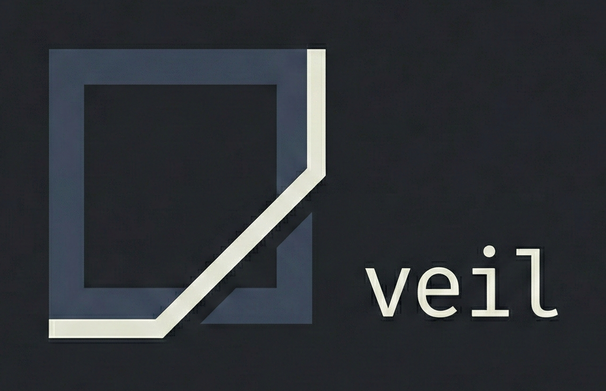

<div align="left">
  
  <h1 style="display: inline-block; vertical-align: middle; margin: 0;">veil<sub style="font-weight: normal;"> alpha ver.</sub></h1>

</div>


**WARNING:** This is a pre-training repo. Incomplete, probably broken, might get thrown away.

I'm using this to learn the prerequisites before building the real project: **Veil**.

---

## What Is Veil?

Veil is a Linux CLI tool that runs apps inside a temporary FUSE-based filesystem sandbox. The core idea: if something isn't explicitly allowed, it doesn't exist to the app. Not blocked—literally invisible.

Only directories you whitelist are visible. System stuff like `/usr` and `/lib` are read-only. When the app exits, the sandbox unmounts and leaves no trace.

The security model is "deny by invisibility" rather than reactive blocking. If it's not allowed, the filesystem just...doesn't show it.

---

## Why This Repo Exists

Honestly? I need to learn a bunch of stuff before attempting the real thing:

- Rust (ownership model, error handling, the whole deal)
- FUSE filesystem programming
- How to map live directories without breaking things
- Logging denied accesses
- Running processes inside a sandboxed environment

The code here is gonna be rough. That's the point "learning by breaking things, not building production software".

---

## How It Works

Basic flow:

1. Mount a FUSE filesystem at some temp location
2. Make only whitelisted directories visible
3. Mount system dirs (`/usr`, `/lib`, etc.) as read-only so stuff can actually run
4. Everything else? Doesn't exist from the app's POV
5. Log any access denials
6. App runs in this restricted filesystem view
7. On exit, unmount and clean up

The key insight: don't block unauthorized access, just don't show it in the first place.

---

## Runtime Flow Example

```
$ veil run --allow ~/Documents krita
→ Creates FUSE mount
→ Mounts system dirs (read-only)
→ Mounts ~/Documents (read-write)
→ Launches krita in the sandbox
→ krita tries to access ~/Pictures → denied (invisible)
→ Logs the attempt
→ You see the log and decide to allow ~/Pictures
→ Now krita can see ~/Pictures
→ krita exits
→ Unmount sandbox, clean slate
```

This should work for pretty much anything: GUI apps, system-installed programs, AppImages, random scripts you downloaded.

---

## Tech Stack

- **Language:** Rust
- **Filesystem:** FUSE (via `fuser` crate)
- **Process Management:** `std::process` for subprocess execution
- **CLI Parsing:** `clap` or similar
- **Logging:** `log` + `env_logger` or `tracing`

## MVP Goals

What I'm trying to get working:

- Basic Rust CLI that doesn't crash immediately
- FUSE filesystem that actually mounts
- Passthrough for user-specified directories
- System directories visible (read-only)
- Logging when something gets denied
- Dynamic "add this folder while it's running" functionality
- Clean mount/unmount without leaving zombie mounts
- Actually execute a process inside the sandbox

These are aspirational. Stuff might not work, might be half-baked, might get scrapped.

---

## Out of Scope

Not even attempting:

- GUI (terminal only)
- Policy engine or config files
- Malware protection
- Any kind of security guarantees
- Integration with apt/dnf/pacman
- Replacing Flatpak/Snap
- Network isolation
- Seccomp filters

To be clear: this is filesystem visibility control. It's not antivirus. It's not a bulletproof sandbox.

---

## Optional Experiments

**Interactive permission mode:** Maybe add a prompt when CLI tools hit a denied path? "Allow access to ~/whatever? [y/n]"

This only makes sense for CLI tools. GUI apps freeze if you block them waiting for input, and nobody wants a frozen window. GUI apps need their permissions configured upfront.

---

## Learning Roadmap

Rough plan of attack:

1. Get comfortable with Rust (syntax, ownership, error handling)
2. FUSE hello-world (mount a minimal read-only filesystem)
3. Directory passthrough (map real directories into the FUSE mount)
4. Process execution (spawn a subprocess inside the sandbox)
5. Denial logging (catch and record filesystem access attempts)
6. Dynamic allow (add directories while the app is running)
7. Cleanup (unmount properly, no zombie mounts)

## What You'll Learn

If I actually finish this thing, I should understand:

- **Rust fundamentals** — ownership, borrowing, lifetimes, error handling (the hard parts)
- **FUSE architecture** — how userspace filesystems actually work
- **Linux filesystem semantics** — mount points, visibility control, read-only mounts
- **Process sandboxing** — filesystem isolation, least privilege
- **Systems programming** — spawning processes, handling signals, cleaning up properly
- **Security models** — deny-by-default thinking, attack surface reduction
- **Logging** — tracking access, auditing denials

Basically all the prerequisite knowledge needed before attempting the real implementation.

---

## Disclaimer

**Security:** This provides zero security guarantees. Don't use it as a replacement for SELinux, AppArmor, or actual containers. Definitely don't rely on it to stop malware.

**Stability:** Pre-alpha quality. Might crash. Might corrupt data. Might leave ghost mounts. Don't run this on anything important.

**Purpose:** This is a learning exercise, not a product. Not intended for actual use.

---

## License

TBD.

---

<sub>*Logo generated with Gemini</sub>
